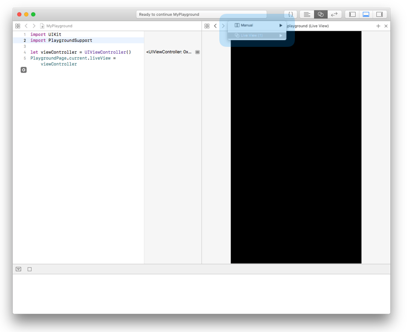

# Creating an interactive readme in playgrounds

## Basic playground introduction

### Where is what and what is where

First open a new Playground in XCode 10. Now there are two ways in which you can run the playground code. 
1.  Down at the left to run the enitre playground
2. Or you can use the play button on the lines

By selecting the box you can show the result inline, so you can see the changes you make.

### The live view
If you want to see the result of ViewControllers you can set the current liveView to your viewController:
`PlaygroundPage.current.liveView = ViewController`
Dont' forget to `Import PlaygroundSupport` when you do this.

Show the assistant editor to make your live view visible

Pro-tip: When you lose your live view you can reselect it in this drop down menu by choosing Live View instead of Manual.

### Files

When you show the navigator you can add files to your play ground

